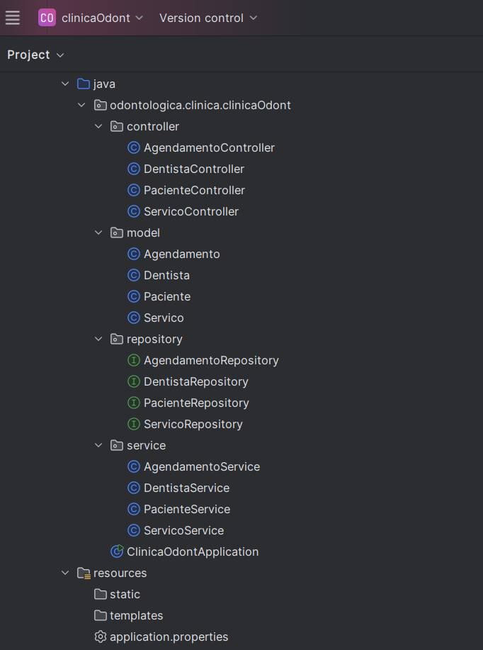
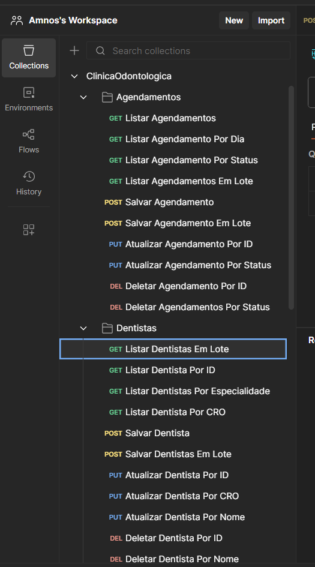
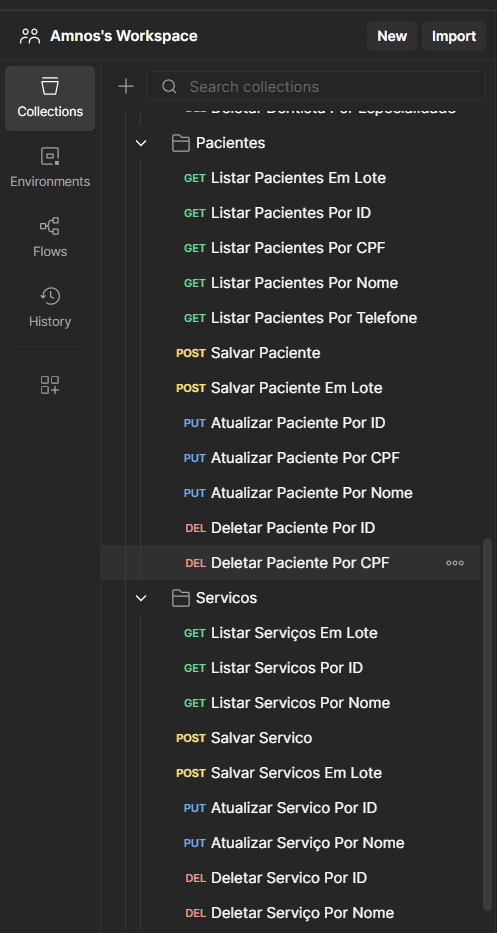
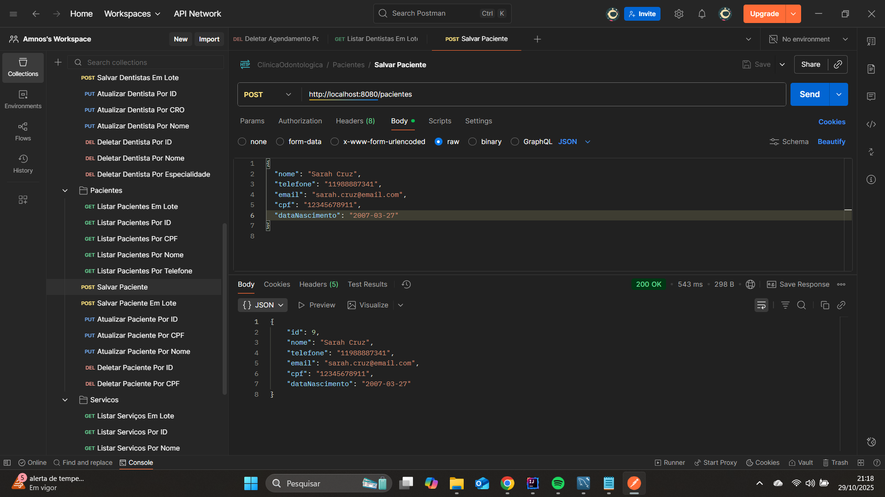
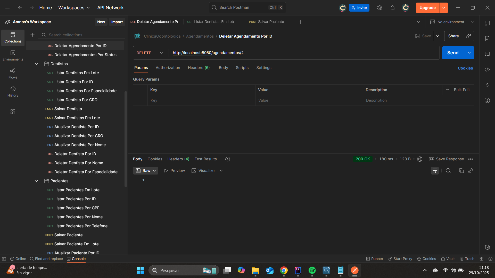
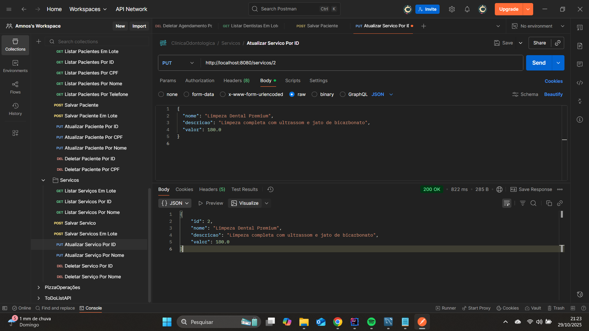
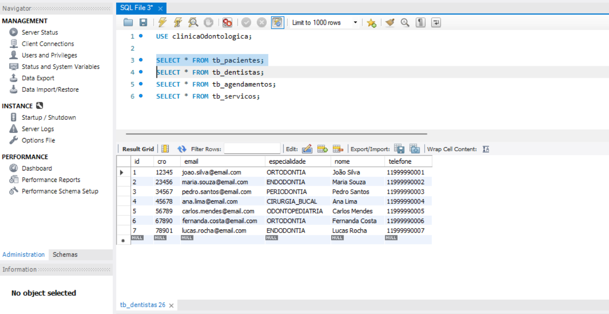
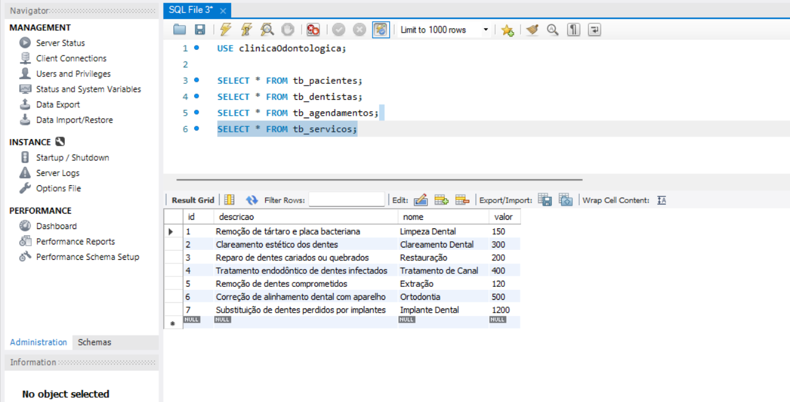
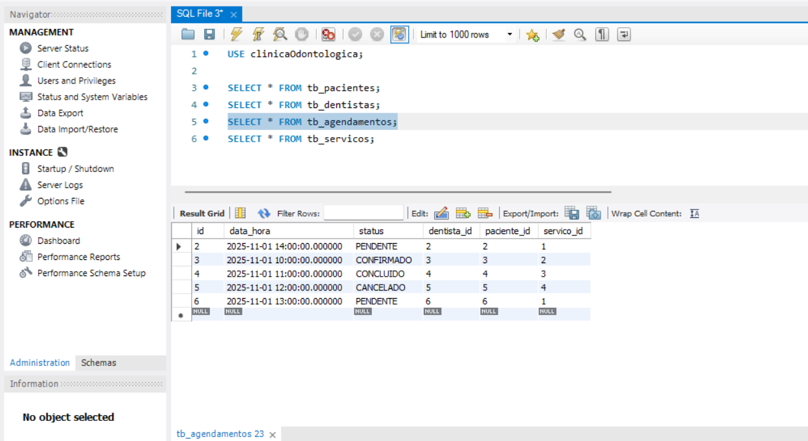
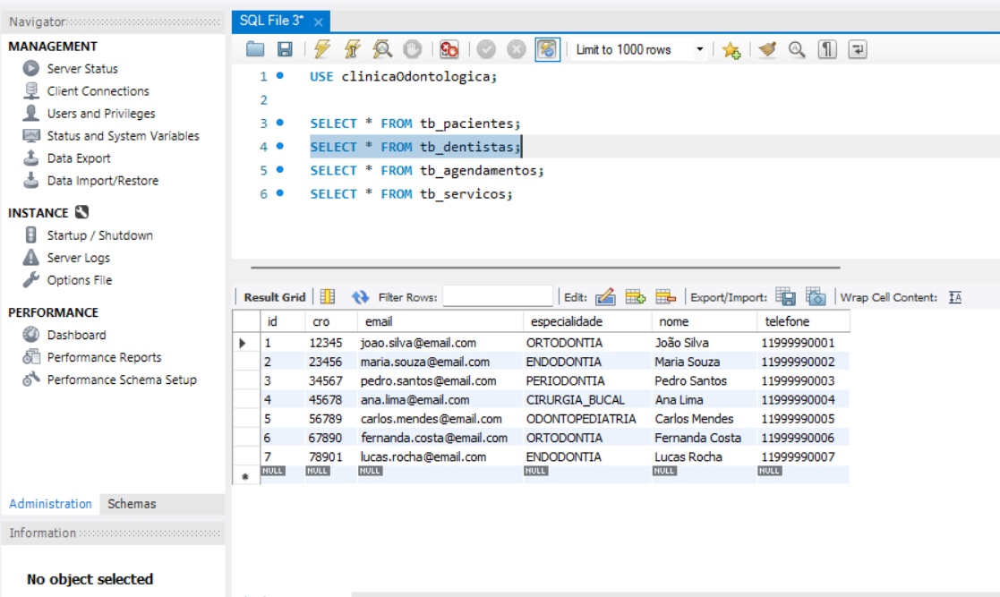

# clinica-odontologica-api
Sistema de agendamento e gestão odontológica feito com Spring Boot e MySQL.

API RESTful desenvolvida em Java com Spring Boot, aplicando JPA/Hibernate e banco de dados relacional (MySQL).
O sistema gerencia pacientes, dentistas, serviços e agendamentos.

## Tecnologias:
- Java 21
- Spring Boot
- Spring Data JPA / Hibernate
- MySQL
- Maven
- Postman

## Funcionalidades:
- CRUD de Pacientes, Dentistas, Serviços e Agendamentos
- Testes de requisição HTTP (GET, POST, PUT, DELETE)
- Validações de dados (como horários e status de agendamentos)
- Relacionamentos entre entidades com JPA

## Banco de Dados
# Tabelas:
- tb_pacientes
- tb_dentistas
- tb_servicos
- tb_agendamentos

## Imagens do Projeto
- Log Spring Boot:

- Estrutura do Projeto:

- Todas as requisições HTTP no Postman:

- Alguns testes no Postman:

- Diagrama das tabelas:

- Dados persistindo no MySQL:

